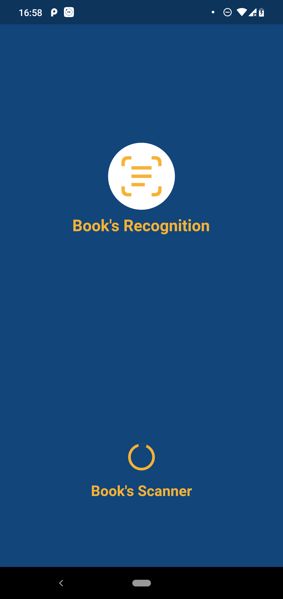
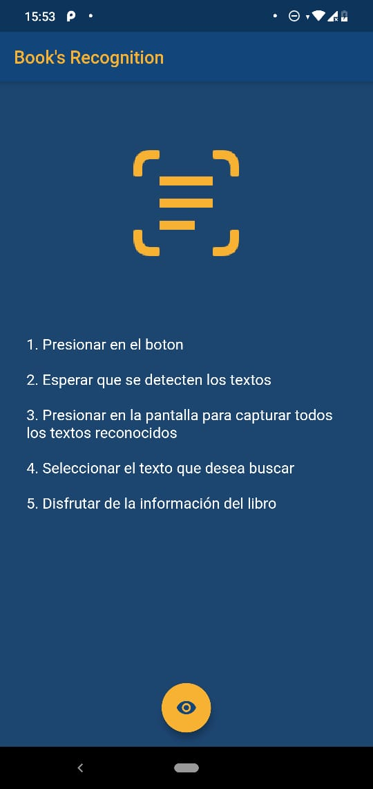
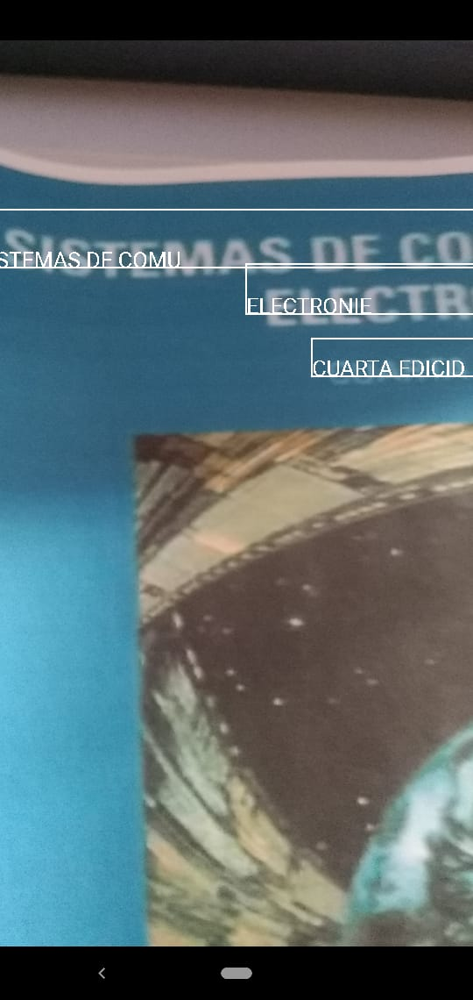
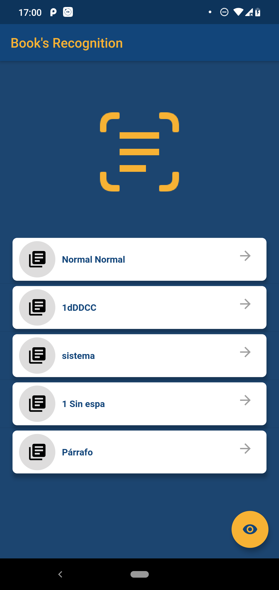
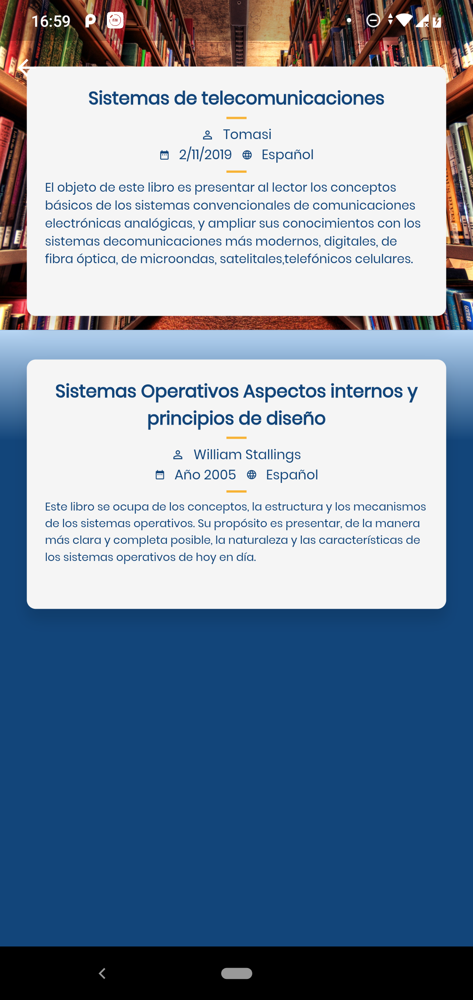
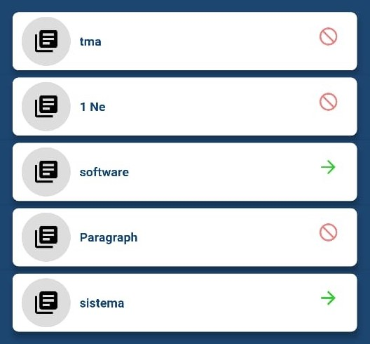
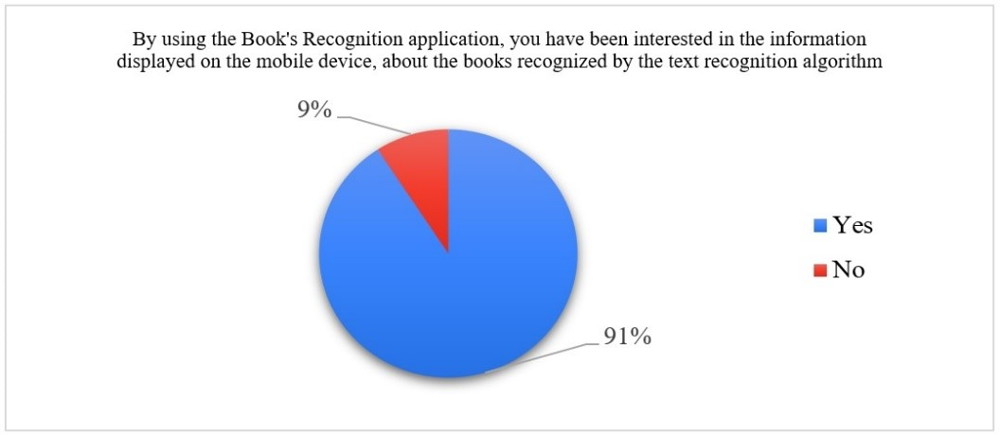
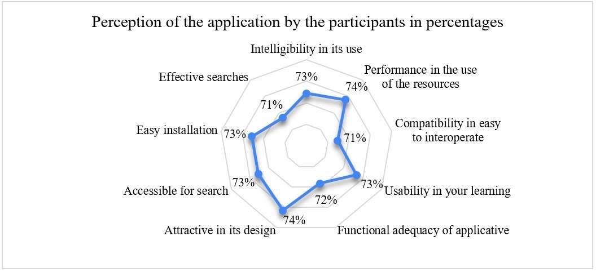

<h1 align="justify">Mobile application with cloud-based computer vision
capability for university students’ library services </h1>

This paper presents the development of the smart device mobile application “Book’s Recognition”. The app recognizes the text of library book titles at the library of the Universidad Politécnica Salesiana in the city of Guayaquil, Ecuador. Through a service stored in Amazon Web Service (AWS), Mobil Vision’s algorithms for text recognition, and <a href="https://developers.google.com/vision/">Google’s API</a> on the Android platform, the app <strong>“<a href="https://drive.google.com/open?id=19IRH2EIkjYm0MBA6Ea-SaDQnkUKobtwQ">Book’s Recognition</a>”</strong> allows its user to recognize the text of the title of a physical book in an innovative and effective way, showing the user basic information about the book in real time. The application can be offered as a service of the library. The purpose of this development is to awaken university student’s interest about new and creative forms of intelligent investigation with resources from the university’s main library, and furthermore to facilitate the investigative process by providing information on non-digitalized, and digitalized, books that hold valuable and relevant information for all generations. The mobile app can be downloaded the following website: https://github.com/seimus96/mobile_vision. <a href="https://www.youtube.com/watch?v=eoDJLw63LEE&feature=youtu.be">Here's the tutorial</a>

## Features
   * [x] Recognize Text
   * [x] Find book's names with recognized text

## User Interface

    

## Traditional way

The usual way university students look for a book upon arriving at the library is by finding the area with books related to the topic they are interested in and then browsing book by book

Finally, the process of loaning a book for reading or investigation is concluded when the loan is registered by the library assistant at the designated check-out desk

## Book's Recognition

For the implementation in the mobile application, a friendly interface is used to present the texts captured by the camera. The values obtained from the captured text, with the exception of the value itself are the language and the positions.The information exchange service is developed in Hypertext Preprocessor (PHP) language searching for captured text in the database of book titles managed by MySQL. The entire text is captured, then the blank spaces on the sides of the image are eliminated.

<table width="100%">
  <tr>
    <th>
      

    </th>
    <th>
      

    </th>
  </tr>
</table>

Una versión mejorada de la aplicación de “Book’s Recognition”, permite la optimización de búsqueda de libros en el momento del reconocimiento del texto que solo contenga información válida acorde a los estándares descritos en la ISO/IEC 25000:2014, como adecuación functional, eficiencia en rendimiento, usabilidad y confiabilidad, que son tomados en consideración

The "Book Recognition" application has been easy to use for 93% of respondents. On the other hand, 91% have motivated him interest in the information affected by the device about the books recognized by the text recognition algorithm for digitized and non-digitized books in the University library. 
An improved version of the “Book's Recognition” application allows the optimization of book searches at the time of text recognition that only contains valid information according to the standards described in ISO / IEC 25000: 2014, such as functional adequacy, performance efficiency, usability and reliability, which are taken into consideration.

It should be noted that the perception of the participants in the characteristics of: intelligibility in their use, performance in the use of the resources used by the application, compatibility in the ease of interoperating the application, usability in their learning, functional adequacy, attractive design, accessibility for the search, effective searches as well as its easy installation, exceed 70% when agreeing and totally agree on its acceptance, with this the “Book's Recognition” application reaches its objective among the participants.

83% of the participants believe that with the “Book's Recognition” application, university students are encouraged to interest book searches within the physical library, for digitized and non-digitized books through new ways of using behavior of the smart device. Additionally, 96% would recommend the use of the application to educational institutions for its implementation and use. Finally, 80% of users recognize that the application is innovative in the environment, that it opens up new opportunities for services using artificial intelligence technologies and that, with a high tenological development, it opens up possibilities not only in academia but also in the administrative field.

## Autores:
- Joe Llerena, jllerena@ups.edu.ec
- Alison Cunalema, acunalema@est.ups.edu.ec
- Fernando Procel, fprocel@est.ups.edu.ec
